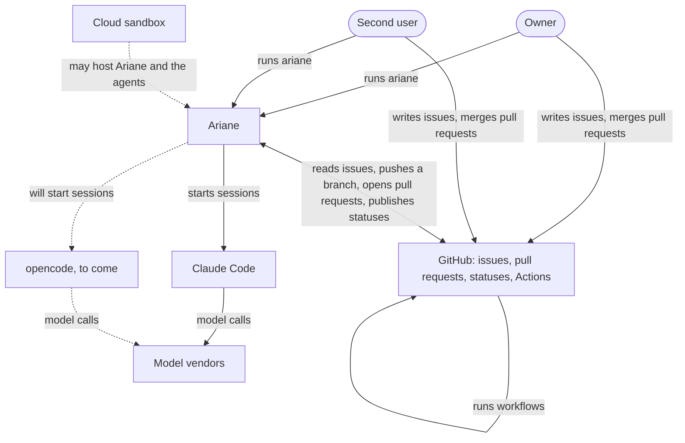

# Level 0: landscape

The people and systems around Ariane.

```mermaid
flowchart TB
  owner([Owner])
  second([Second user])
  ariane[Ariane]
  github[GitHub: issues, pull requests, statuses, Actions]
  claude[Claude Code]
  opencode[opencode, to come]
  vendors[Model vendors]
  sandbox[Cloud sandbox]
  owner -->|writes issues, merges pull requests| github
  second -->|writes issues, merges pull requests| github
  owner -->|runs ariane| ariane
  second -->|runs ariane| ariane
  ariane <-->|reads issues, pushes a branch, opens pull requests, publishes statuses| github
  ariane -->|starts sessions| claude
  ariane -.->|will start sessions| opencode
  claude -->|model calls| vendors
  opencode -.->|model calls| vendors
  github -->|runs workflows| github
  sandbox -.->|may host Ariane and the agents| ariane
```

The owner and the second user (ADR 0021) each run their own Ariane. The owner merges; Ariane
never does.
