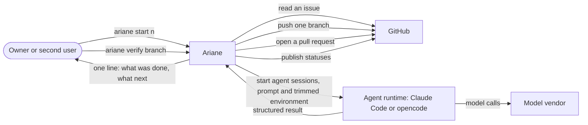

# Level 1: system context

Ariane as one system and what it exchanges with each neighbour.

`ariane verify` works on a local branch: it commits its records on it and never pushes.
Only `ariane start` pushes, and only once, after the checks passed on a clean replay (ADR 0018).
Agents never receive the GitHub token.
