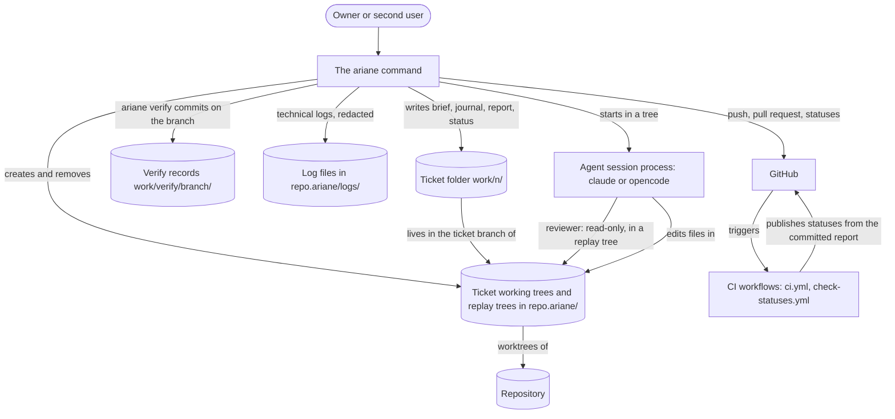

# Level 2: containers

What runs and what is stored.

- `ci.yml` runs the checks on Windows, macOS and Linux (ADR 0005).
- `check-statuses.yml` publishes the statuses from the committed report when Ariane cannot.
- The reviewer session is read-only: its tools exclude writing and it runs in a clean replay tree.
  On opencode it ignores project configuration files.
- The ticket folder is committed with the ticket and readable without Ariane.
