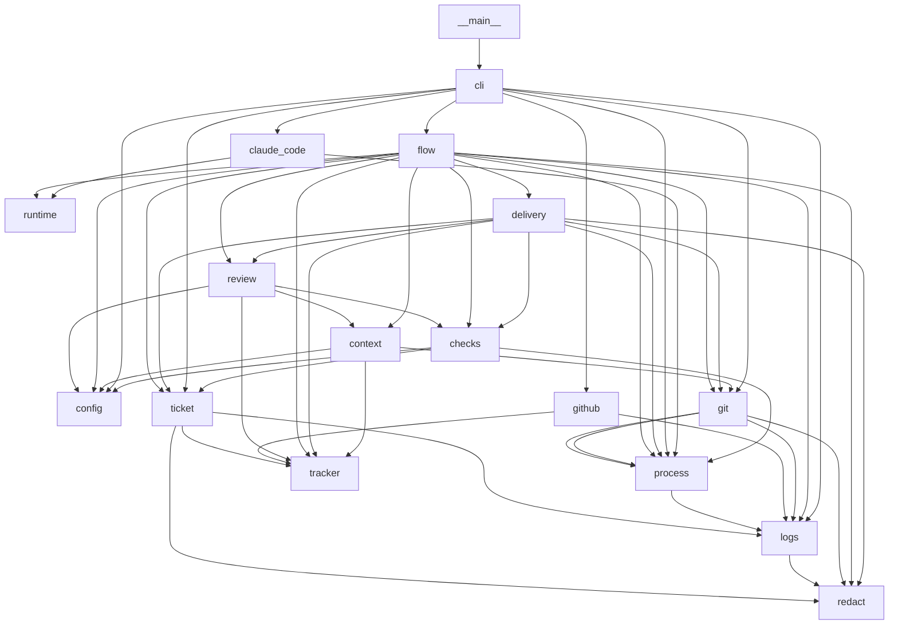

# Level 3: components

## Modules and their dependencies

An arrow goes from a module to a module it imports. Each module has a file in
[`modules/`](modules/).



## `ariane start <n>`

```mermaid
sequenceDiagram
  actor U as User
  participant CLI as cli
  participant F as flow
  participant T as tracker (github)
  participant G as git
  participant R as runtime (claude_code)
  participant C as checks
  participant D as delivery
  U->>CLI: ariane start n
  CLI->>F: start
  F->>T: read the issue
  F->>G: add the ticket working tree
  F->>F: setup command, ticket folder brief
  F->>R: run the implementer session
  R-->>F: SessionResult
  F->>G: guard checks (configuration, branch, untracked files)
  F->>G: commit
  F->>G: add a clean replay tree
  F->>C: replay the checks
  C-->>F: results
  F->>R: run a read-only reviewer session in the replay tree
  R-->>F: answer (validated by review, one retry)
  F->>G: verify git, the tree and the remote did not change
  F->>F: review-0.md; go continues, no-go stops (needs a human)
  F->>D: deliver
  D->>G: one push
  D->>T: open the pull request
  D->>T: publish statuses
  F-->>CLI: Outcome
  CLI-->>U: one line
```
