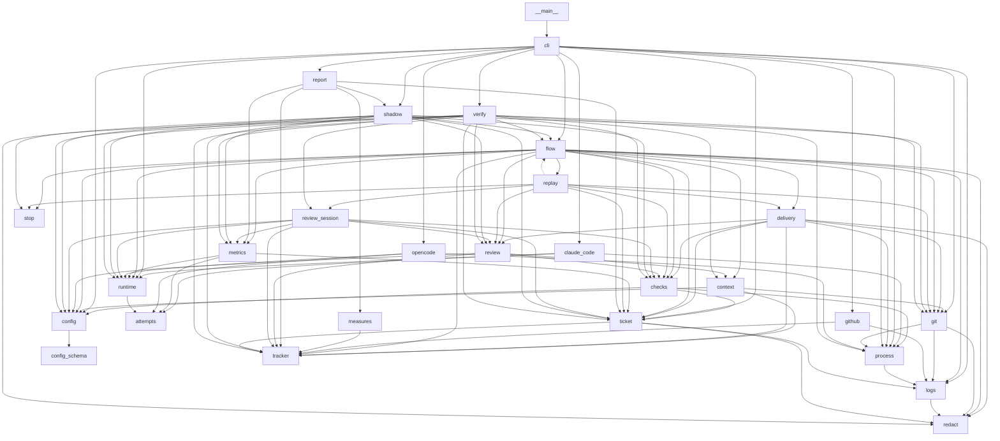
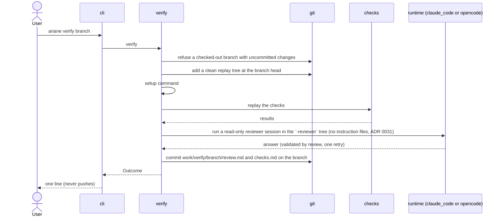

# Level 3: components

## Modules and their dependencies

An arrow goes from the importing module to the imported module; a dashed arrow is an import for
type checking only. Each module has a file in
[`modules/`](modules/).

<!-- generated: dependencies -->

```mermaid
flowchart TD
  __main__ --> cli
  checks --> config
  checks --> process
  checks --> ticket
  claude_code --> attempts
  claude_code --> process
  claude_code --> runtime
  cli --> claude_code
  cli --> config
  cli --> flow
  cli --> git
  cli --> github
  cli --> logs
  cli --> opencode
  cli --> process
  cli --> report
  cli --> runtime
  cli --> shadow
  cli --> ticket
  cli --> verify
  config --> config_schema
  context --> config
  context --> git
  context --> tracker
  delivery --> checks
  delivery --> git
  delivery --> process
  delivery --> redact
  delivery --> review
  delivery --> ticket
  delivery --> tracker
  flow --> checks
  flow --> config
  flow --> context
  flow --> delivery
  flow --> git
  flow --> logs
  flow --> metrics
  flow --> process
  flow --> redact
  flow --> replay
  flow --> review
  flow --> runtime
  flow --> stop
  flow --> ticket
  flow --> tracker
  git --> logs
  git --> process
  git --> redact
  github --> logs
  github --> tracker
  logs --> redact
  measures --> tracker
  metrics --> attempts
  metrics --> runtime
  metrics --> ticket
  opencode --> attempts
  opencode --> process
  opencode --> runtime
  process --> logs
  replay --> checks
  replay --> delivery
  replay -.-> flow
  replay --> git
  replay --> review
  replay --> review_session
  replay --> stop
  replay --> ticket
  report --> measures
  report --> metrics
  report --> shadow
  report --> ticket
  report --> tracker
  review --> checks
  review --> config
  review --> context
  review --> tracker
  review_session --> checks
  review_session --> config
  review_session --> metrics
  review_session --> review
  review_session --> runtime
  review_session --> ticket
  review_session --> tracker
  runtime --> attempts
  shadow --> checks
  shadow --> config
  shadow --> flow
  shadow --> git
  shadow --> metrics
  shadow --> review
  shadow --> runtime
  shadow --> stop
  shadow --> ticket
  shadow --> tracker
  ticket --> logs
  ticket --> redact
  ticket --> tracker
  verify --> checks
  verify --> config
  verify --> context
  verify --> flow
  verify --> git
  verify --> metrics
  verify --> process
  verify --> redact
  verify --> review
  verify --> review_session
  verify --> runtime
  verify --> ticket
  verify --> tracker
```
<!-- end generated -->

## `ariane start <n>`

```mermaid
sequenceDiagram
  actor U as User
  participant CLI as cli
  participant F as flow
  participant T as tracker (github)
  participant G as git
  participant R as runtime (claude_code or opencode)
  participant C as checks
  participant D as delivery
  U->>CLI: ariane start n
  CLI->>F: start
  F->>T: read the issue
  F->>G: add the ticket working tree
  F->>F: setup command, ticket folder brief
  F->>R: run the implementer session
  R-->>F: SessionResult
  F->>G: guard checks (configuration, branch, untracked files)
  F->>G: commit
  F->>G: add a clean replay tree
  F->>C: replay the checks
  C-->>F: results
  alt a blocking check failed
    F-->>CLI: stop before any review, push nothing
  end
  F->>R: run a read-only reviewer session in the reviewer tree (no instruction files, ADR 0031)
  R-->>F: answer (validated by review, one retry)
  F->>G: verify git, the tree and the remote did not change
  F->>F: review-0.md; go continues
  loop at most two fix rounds, while the review is no-go
    F->>R: run a fresh implementer session with the findings
    F->>G: guard checks, commit, clean replay, checks
    F->>R: run a read-only reviewer session (review-1.md, review-2.md)
  end
  F->>D: deliver
  D->>G: one push
  D->>T: open the pull request (a draft, needs a human, if still no-go)
  D->>T: publish statuses
  F-->>CLI: Outcome
  CLI-->>U: one line
```

## `ariane verify <branch>`

```mermaid
sequenceDiagram
  actor U as User
  participant CLI as cli
  participant V as verify
  participant G as git
  participant C as checks
  participant R as runtime (claude_code or opencode)
  U->>CLI: ariane verify branch
  CLI->>V: verify
  V->>G: refuse a checked-out branch with uncommitted changes
  V->>G: add a clean replay tree at the branch head
  V->>V: setup command
  V->>C: replay the checks
  C-->>V: results
  V->>R: run a read-only reviewer session in the `-reviewer` tree (no instruction files, ADR 0031)
  R-->>V: answer (validated by review, one retry)
  V->>G: commit work/verify/branch/review.md and checks.md on the branch
  V-->>CLI: Outcome
  CLI-->>U: one line (never pushes)
```
