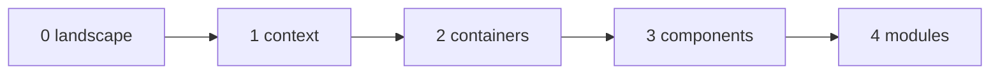

# Architecture of Ariane

How Ariane works, in Mermaid diagrams (flowcharts and sequence diagrams, ADR 0022), one file per
C4 level. Each level zooms into the previous one.

| Level | File | Shows |
| --- | --- | --- |
| 0 | [`0-landscape.md`](0-landscape.md) | The people and systems around Ariane. |
| 1 | [`1-context.md`](1-context.md) | Ariane as one system and what it exchanges with each neighbour. |
| 2 | [`2-containers.md`](2-containers.md) | The command, the working trees, the ticket folder, the sessions, the CI workflows. |
| 3 | [`3-components.md`](3-components.md) | The modules, their dependencies, and `ariane start <n>` step by step. |
| 4 | [`modules/`](modules/) | One file per module under `src/ariane/`. |

A test (`tests/test_docs_architecture.py`) fails when a module has no file in `modules/` or a file
there names a module that does not exist. Update these files in the same ticket as the code
(CLAUDE.md rule 11).

## Modules

- [`__main__`](modules/__main__.md)
- [`checks`](modules/checks.md)
- [`claude_code`](modules/claude_code.md)
- [`cli`](modules/cli.md)
- [`config`](modules/config.md)
- [`config_schema`](modules/config_schema.md)
- [`context`](modules/context.md)
- [`delivery`](modules/delivery.md)
- [`flow`](modules/flow.md)
- [`git`](modules/git.md)
- [`github`](modules/github.md)
- [`logs`](modules/logs.md)
- [`opencode`](modules/opencode.md)
- [`process`](modules/process.md)
- [`redact`](modules/redact.md)
- [`runtime`](modules/runtime.md)
- [`ticket`](modules/ticket.md)
- [`tracker`](modules/tracker.md)
