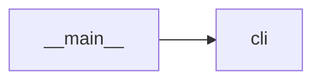

# Module `ariane.__main__`

Lets `python -m ariane` run the command line. It holds no logic of its own.

## Main types and functions

- `main` (imported from `cli`) is the exit code of the process.

## Collaborations

Arrows go from the caller to the callee.

## Serves

C23; ADR 0002. See [the component view](../3-components.md).
