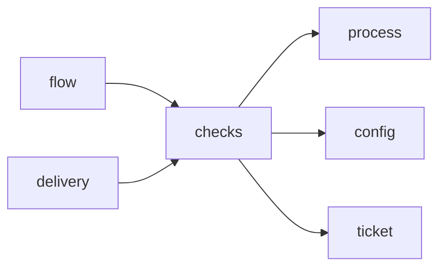

# Module `ariane.checks`

Runs the deterministic checks of `ariane.toml` itself and never believes an agent. It also renders the results as a summary line, a table and a committed report.

## Main types and functions

- `CheckResult`: name, blocking flag, outcome and output of one check.
- `run_checks`, `run_check`: run the declared commands in a working tree; the flow also passes the generated-documentation commands as checks named `docs: <name>` (C25), so they appear in the report and the statuses like any check.
- `blocking_failures`, `summary_line`, `summary_table`, `report`: read and render results.
- `parse_summary_table`: read a committed report back.

## Collaborations

Arrows go from the caller to the callee.

## Serves

C9, C21, C25; ADR 0004, ADR 0018, ADR 0026. See [the component view](../3-components.md).
