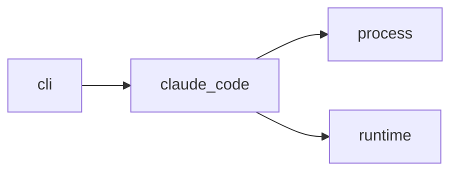

# Module `ariane.claude_code`

Claude Code as an agent runtime: it starts the `claude` CLI for one session and turns its structured output into a `SessionResult`.

## Main types and functions

- `ClaudeCodeRuntime`: implements `AgentRuntime`.
- `parse_result`: maps stdout, stderr and the exit code to a result and a stop reason.

## Collaborations

Arrows go from the caller to the callee.

## Serves

C5; ADR 0007, ADR 0015. See [the component view](../3-components.md).
