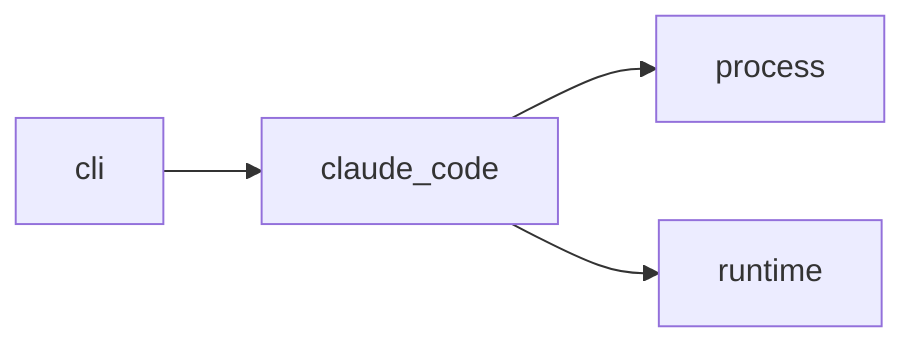

# Module `ariane.claude_code`

Claude Code as an agent runtime: it starts the `claude` CLI for one session and turns its structured output into a `SessionResult`. It reads `--output-format stream-json --verbose` line by line, counts tokens per `message.id` (the latest usage of each id counts once) and stops the session when the total reaches `Session.max_tokens` (stop reason `budget`, "stopped by Ariane at <n> tokens"); `--max-budget-usd` stays the runtime's own cost cap, and `SessionResult.cap` names the cap that applied.

## Main types and functions

- `ClaudeCodeRuntime`: implements `AgentRuntime`; it declares `ANTHROPIC_` and `CLAUDE_` as its login variables.
- `TokenTally`: the running token total of a stream.
- `parse_result`: maps the final `result` event (or a single JSON result), stderr and the exit code to a result and a stop reason; a stream without a result is `error`.

## Collaborations

Arrows go from the caller to the callee.

## Serves

C5; ADR 0007, ADR 0015. See [the component view](../3-components.md).
