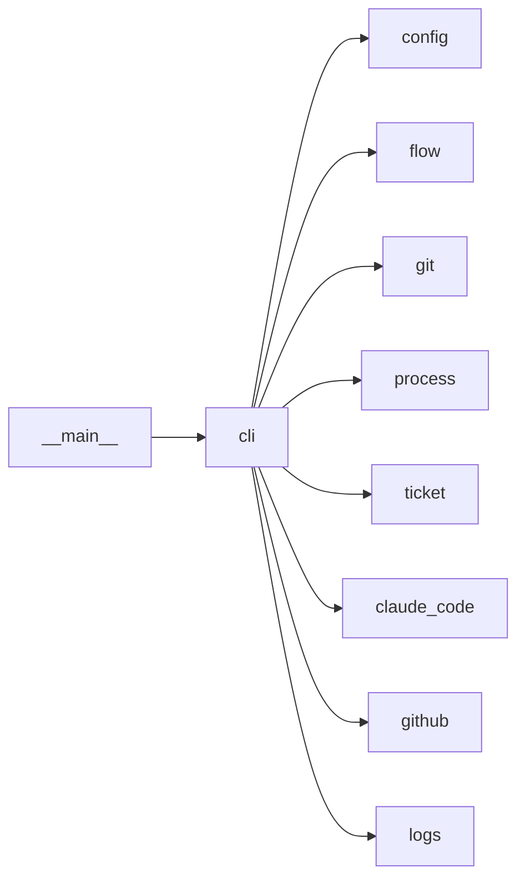

# Module `ariane.cli`

The `ariane` command line. It parses arguments, wires the configuration, tracker and runtime, calls the flow, and ends every command with one line saying what it did and what comes next.

## Main types and functions

- `main`: the entry point, returns the exit code.

## Collaborations

Arrows go from the caller to the callee.

## Reference

See the generated [command-line reference](../../reference/cli.md), generated from the code (`scripts/generate_docs.py`).

## Serves

C23; ADR 0002. See [the component view](../3-components.md).
