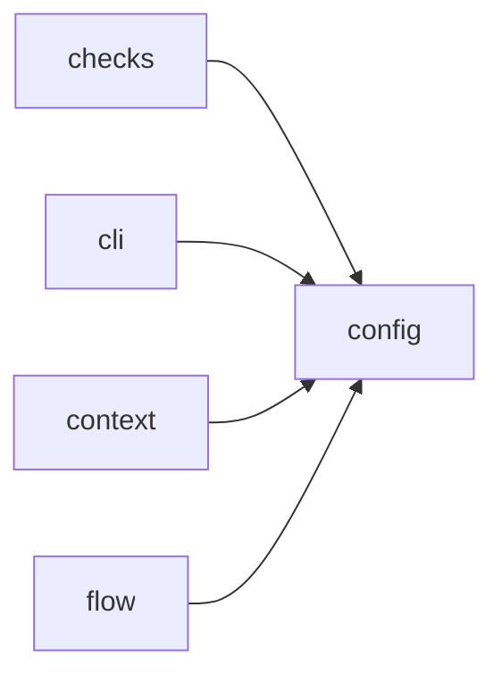

# Module `ariane.config`

Loads and validates `ariane.toml`. Every error names the faulty key.

## Main types and functions

- `Config`, `TrackerConfig`, `AgentConfig`, `CheckConfig`, `DoneItem`: the validated settings; `Config.definition_of_done` holds the
  definition of done (C26), `DEFAULT_DEFINITION_OF_DONE` when the table is absent.
- `AgentConfig.max_tokens`: optional `[agents.<role>] max_tokens`, a positive integer, Ariane's own token cap per session.
- `Config.reviewer`: the required `[agents.reviewer]` table (same keys as the implementer's); `parse` refuses a reviewer model equal to the implementer's, naming `agents.reviewer.model` (C10).
- Globs (`documentation.map[].source`): `**/` matches zero or more whole folders (`src/**/*.py` matches `src/a.py`); other `**` crosses segments (ADR 0026).
- Check names: a `[[checks]]` name starting with `docs: ` is refused (`checks[i].name`); `{ check = "docs: <name>" }` is accepted in the definition of done when `<name>` is a `[documentation.generated]` entry (C26).
- `Documentation`, `DocMapEntry`, `GeneratedDoc`: the optional `[documentation]` table (C25, ADR 0026): `paths`, `[[documentation.map]]` (`{stem}` expands, `*` stays in a folder), `[[documentation.generated]]`. `Documentation.not_updated` lists mapped documents a change left untouched; `Documentation.checks` turns generated entries into blocking checks `docs: <name>`. `Config.documentation` is empty without the table.
- `SCHEMA` (re-exported from `config_schema`): the JSON Schema of the file.
- `load`: read the file at the repository root, or the file `ARIANE_CONFIG` names (relative to the repository root; errors then name `ARIANE_CONFIG (<file>)`), with the same validation (C22).
- Runtimes (C5, ADR 0029): `runtime` is `claude-code`, or `opencode` for the reviewer only; naming opencode for the implementer is refused with the role. An opencode agent takes `<provider>/<model>` and tools among `read`, `glob`, `grep`.
- `parse`: validate a parsed TOML mapping.
- `ConfigError`: raised for any invalid key.

## Collaborations

Arrows go from the caller to the callee.

## Reference

See the generated [JSON Schema of `ariane.toml`](../../reference/ariane.toml.schema.json), generated from the code (`scripts/generate_docs.py`).

## Serves

C10, C22, C25, C26; ADR 0003, ADR 0023, ADR 0016, ADR 0026. See [the component view](../3-components.md).
