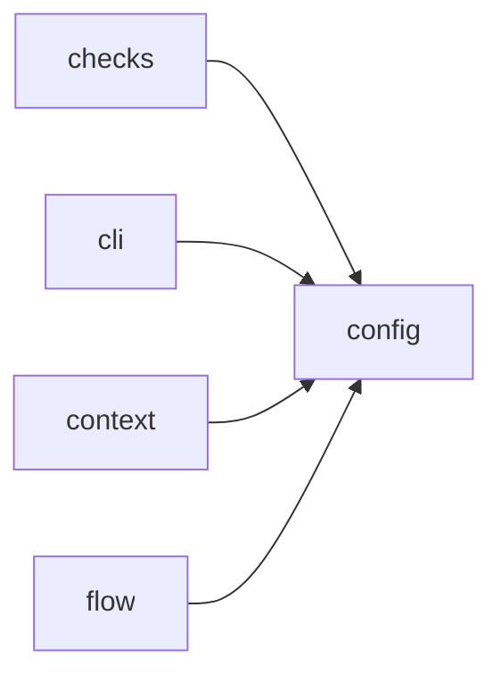

# Module `ariane.config`

Loads and validates `ariane.toml`. Every error names the faulty key.

## Main types and functions

- `Config`, `TrackerConfig`, `AgentConfig`, `CheckConfig`, `DoneItem`: the validated settings; `Config.definition_of_done` holds the
  definition of done (C26), `DEFAULT_DEFINITION_OF_DONE` when the table is absent.
- `AgentConfig.max_tokens`: optional `[agents.<role>] max_tokens`, a positive integer, Ariane's own token cap per session.
- `Config.reviewer`: the required `[agents.reviewer]` table (same keys as the implementer's); `parse` refuses a reviewer model equal to the implementer's, naming `agents.reviewer.model` (C10).
- `load`: read the file at the repository root.
- `parse`: validate a parsed TOML mapping.
- `ConfigError`: raised for any invalid key.

## Collaborations

Arrows go from the caller to the callee.

## Reference

See the generated [JSON Schema of `ariane.toml`](../../reference/ariane.toml.schema.json), generated from the code (`scripts/generate_docs.py`).

## Serves

C10, C22, C26; ADR 0003, ADR 0023, ADR 0016. See [the component view](../3-components.md).
