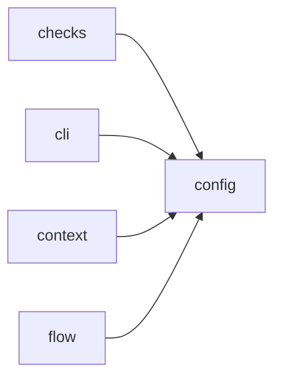

# Module `ariane.config`

Loads and validates `ariane.toml`. Every error names the faulty key.

## Main types and functions

- `Config`, `TrackerConfig`, `AgentConfig`, `CheckConfig`: the validated settings.
- `load`: read the file at the repository root.
- `parse`: validate a parsed TOML mapping.
- `ConfigError`: raised for any invalid key.

## Collaborations

Arrows go from the caller to the callee.

## Serves

C22; ADR 0003. See [the component view](../3-components.md).
