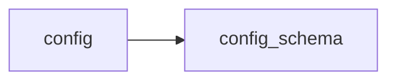

# Module `ariane.config_schema`

The description of `ariane.toml` as a JSON Schema (`SCHEMA`, written to `docs/reference/ariane.toml.schema.json` by `scripts/generate_docs.py`) and the runtimes each role may use: `claude-code` for both roles, `opencode` for the reviewer (ADR 0029). `config.parse` is the validation; a test checks that both agree.

## Main types and functions

- `SCHEMA`: the schema of the file.
- `RUNTIMES`, `OPENCODE_TOOLS`: the runtimes allowed per role and the tools of an opencode agent.

## Collaborations

Arrows go from the caller to the callee.

## Serves

C22, C5; ADR 0003, ADR 0022, ADR 0029. See [the component view](../3-components.md).
