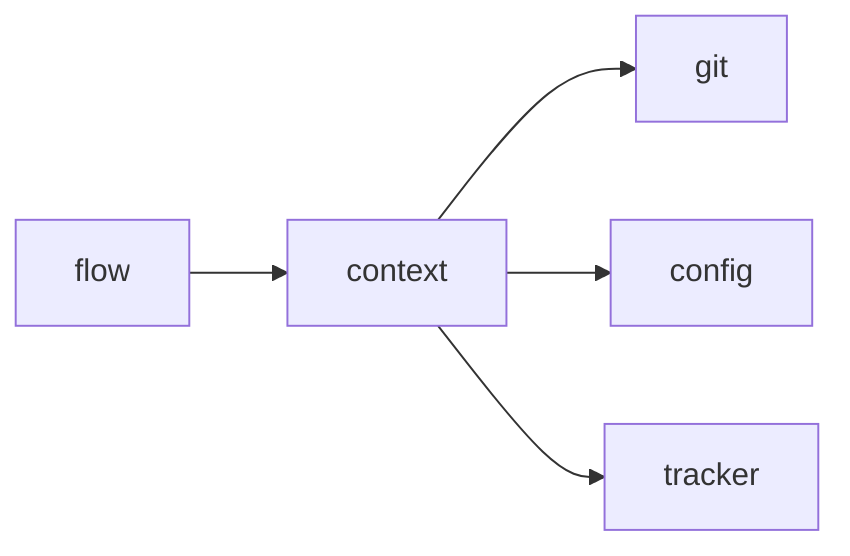

# Module `ariane.context`

Builds what an agent receives from Ariane: its prompt and a trimmed environment that holds no secret.

## Main types and functions

- `implementer_prompt`: the prompt of the implementer session.
- `known_secrets`: the values to redact.
- `untrusted_environment`: the environment of an agent process.

## Collaborations

Arrows go from the caller to the callee.

## Serves

C5, C21; ADR 0015. See [the component view](../3-components.md).
