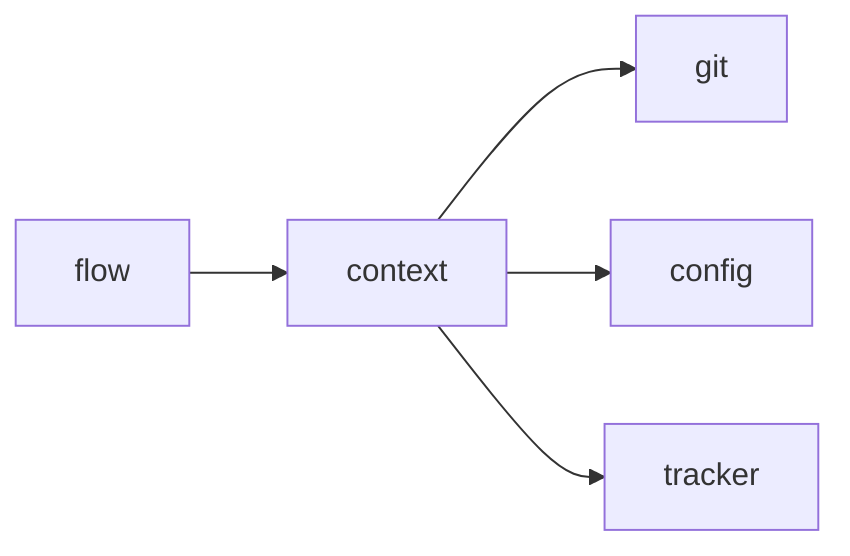

# Module `ariane.context`

Builds what an agent receives from Ariane: its prompt and a trimmed environment that holds no secret.

## Main types and functions

- `implementer_prompt`: the prompt of the implementer session: rules, the checks to replay and the
  definition of done (C26).
- `known_secrets`: the values to redact.
- `untrusted_environment`: the environment of an agent process. It keeps only the login variables the runtime declares (`login_variables`: exact names, and prefixes ending in `_`, ADR 0024); the checks' environment gets none. `known_secrets` still masks a kept login variable whose name looks like a credential.

## Collaborations

Arrows go from the caller to the callee.

## Serves

C5, C21, C26; ADR 0015. See [the component view](../3-components.md).
