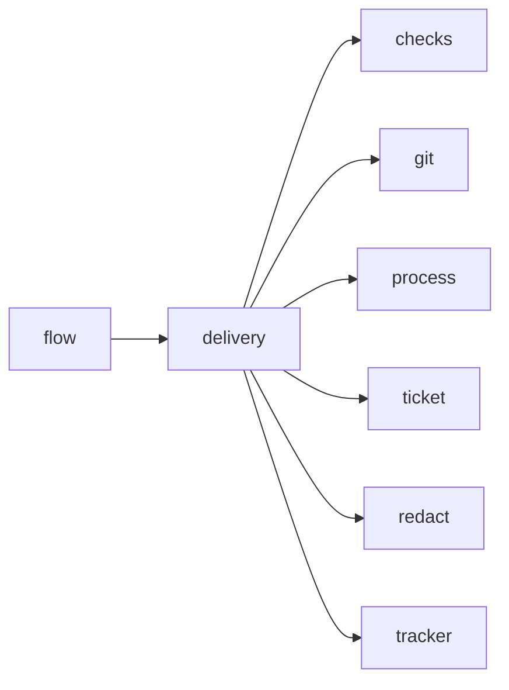

# Module `ariane.delivery`

Delivers a ticket whose blocking checks passed: one push, the pull request and the commit statuses.

## Main types and functions

- `Delivery`: performs the delivery.
- `Delivered`: the pull request and the statuses published.
- `PullRequestRefused`: raised when the tracker refuses the pull request.

## Collaborations

Arrows go from the caller to the callee.

## Serves

C11, C21; ADR 0017, ADR 0018. See [the component view](../3-components.md).
