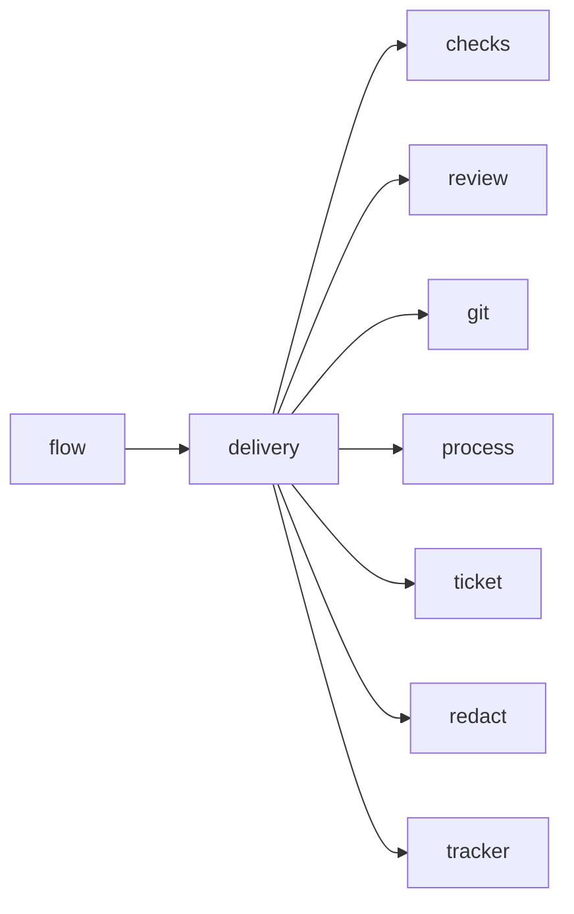

# Module `ariane.delivery`

Delivers a ticket: one push, the pull request (a draft that can carry failing blocking checks, after the fix rounds) and the commit statuses.

## Main types and functions

- `Delivery`: performs the delivery.
- `Delivered`: the pull request (and whether it is a draft) and the statuses published. When the last review is still `no-go` after the fix rounds the pull request is a draft whose body says "Needs a human", and the ticket status is `needs a human` with next action "finish by hand, then run `ariane verify`". The pull request body carries the review's verdict and definition-of-done results.
- `PullRequestRefused`: raised when the tracker refuses the pull request.

## Collaborations

Arrows go from the caller to the callee.

## Serves

C11, C21; ADR 0017, ADR 0018, ADR 0027. See [the component view](../3-components.md).
