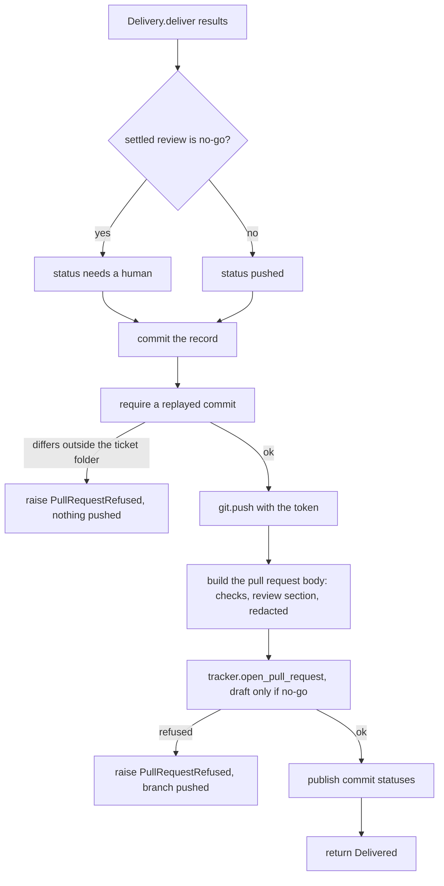
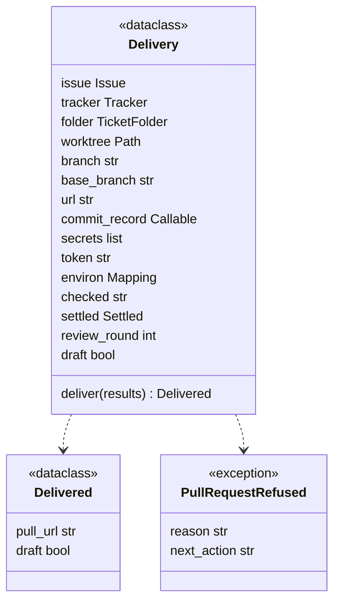
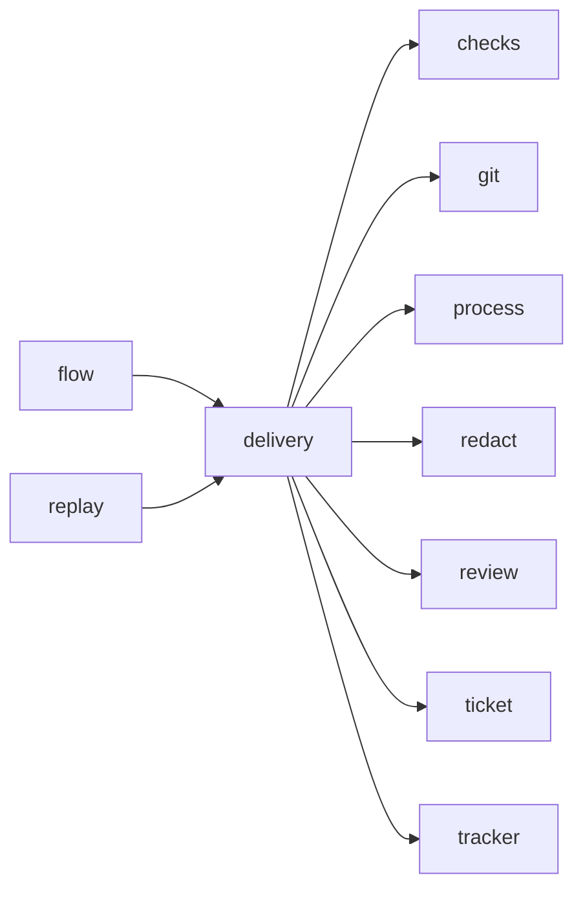

# Module `ariane.delivery`

Delivers a ticket: one push, the pull request (a draft that can carry failing blocking checks, after the fix rounds) and the commit statuses.

## Public API

| Name | Kind | What it does |
| --- | --- | --- |
| `FAILURES` | constant | The exception types a delivery step can raise (git, tracker, OS, missing command). |
| `PullRequestRefused` | exception | The tracker refused the pull request; carries `reason` and `next_action`. |
| `Delivered` | dataclass | The result: `pull_url` and `draft`. |
| `Delivery` | dataclass | Performs the delivery of one ticket; `deliver(results)` pushes, opens the pull request and publishes the statuses. |

## Behaviour and errors

- `Delivery.guard`: called right before `git.push` (ADR 0017); it raises `Stop` when git, the branch or the remote changed, or when a local `url.*.insteadof` or `url.*.pushinsteadof` key exists.
- `Delivery`: performs the delivery.
- `Delivered`: the pull request (and whether it is a draft) and the statuses published. When the last review is still `no-go` after the fix rounds the pull request is a draft whose body says "Needs a human", and the ticket status is `needs a human` with next action "finish by hand, then run `ariane verify`". The pull request body carries the review's verdict and definition-of-done results.
- `PullRequestRefused`: raised when the tracker refuses the pull request.

## Workflow

```mermaid
flowchart TD
  A[Delivery.deliver results] --> E{settled review is no-go?}
  E -- yes --> F[status needs a human]
  E -- no --> G[status pushed]
  F --> H[commit the record]
  G --> H
  H --> B[require a replayed commit]
  B -- differs outside the ticket folder --> X[raise PullRequestRefused, nothing pushed]
  B -- ok --> C[git.push with the token]
  C --> D[build the pull request body: checks, review section, redacted]
  D --> O[tracker.open_pull_request, draft only if no-go]
  O -- refused --> X2[raise PullRequestRefused, branch pushed]
  O -- ok --> I[publish commit statuses]
  I --> J[return Delivered]
```

## Code view (C4 level 4)

```mermaid
classDiagram
class Delivery {
  <<dataclass>>
  issue Issue
  tracker Tracker
  folder TicketFolder
  worktree Path
  branch str
  base_branch str
  url str
  commit_record Callable
  secrets list
  token str
  environ Mapping
  checked str
  settled Settled
  review_round int
  deliver(results) Delivered
  draft bool
}
class Delivered {
  <<dataclass>>
  pull_url str
  draft bool
}
class PullRequestRefused {
  <<exception>>
  reason str
  next_action str
}
Delivery ..> Delivered
Delivery ..> PullRequestRefused
```

## Collaborations

Arrows go from the importing module to the imported module; a dashed arrow is an import for type checking only.

<!-- generated: collaborations -->

```mermaid
flowchart LR
  delivery --> checks
  delivery --> git
  delivery --> process
  delivery --> redact
  delivery --> review
  delivery --> ticket
  delivery --> tracker
  flow --> delivery
  replay --> delivery
```
<!-- end generated -->

## Serves

C11, C21; ADR 0017, ADR 0018, ADR 0027. See [the component view](../3-components.md).
