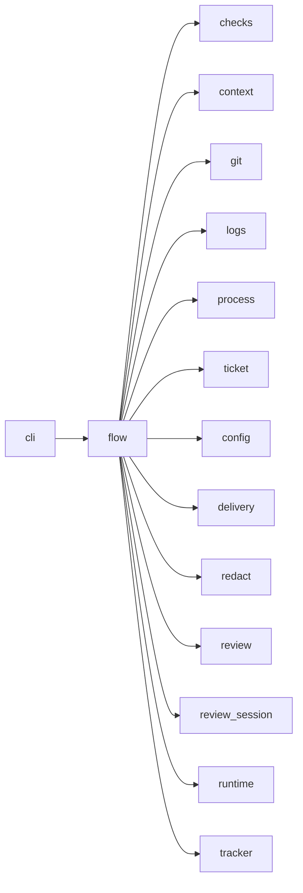

# Module `ariane.flow`

`ariane start`: turns one issue into a pull request whose checks Ariane replayed. It sets up the working tree, runs the agent session, applies the guards, commits, replays the checks on a clean tree, runs the read-only reviewer in that tree (C10), runs up to two fix rounds after a negative review and hands over to delivery.

## Main types and functions

- `start`: the whole flow for one ticket number.
- `Outcome`: the result reported to the command line.
- `Stop`: ends the flow early with a recorded reason.
- Documentation upkeep (C25): after the agent's work is committed, mapped documents of changed files that the ticket did not change are journaled (`ticket.docs.not_updated`) and given to the reviewer; the `generated` documentation commands run in the clean replay as blocking checks `docs: <name>`, in `checks.md` and the statuses.
- Each reviewer session journals `ticket.review.stopped` ("Reviewer session <n> stopped: <reason>") with its cost and tokens, in the implementer's format, including an invalid answer's.
- Fix rounds (C10, ADR 0027): after a `no-go`, or blocking checks failing after a fix round, a fresh implementer session gets the findings (an escaped untrusted block) and fixes them in the ticket's working tree; Ariane commits, replays the checks in a clean tree and reviews again (`review-1.md`, `review-2.md`). After the second fix round a review still `no-go` is delivered as a draft pull request with status `needs a human`. The journal records each round's sessions (`ticket.fix.round`, `ticket.session.*`, `ticket.review.*`) and verdict.
- `worktree_path`, `branch_name`: where a ticket lives.

## Collaborations

Arrows go from the caller to the callee.

## Serves

C1, C5, C9, C10, C11, C25; ADR 0006, ADR 0017, ADR 0018, ADR 0019, ADR 0016, ADR 0025, ADR 0026, ADR 0027. See [the component view](../3-components.md).
