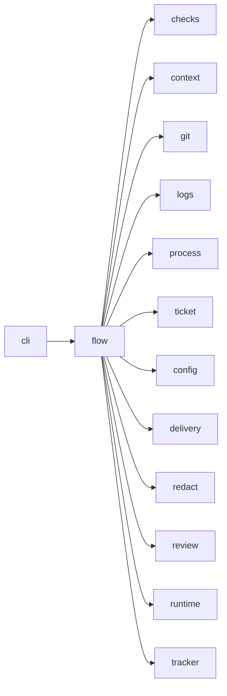

# Module `ariane.flow`

`ariane start`: turns one issue into a pull request whose checks Ariane replayed. It sets up the working tree, runs the agent session, applies the guards, commits, replays the checks on a clean tree, runs the read-only reviewer in that tree (C10) and hands over to delivery.

## Main types and functions

- `start`: the whole flow for one ticket number.
- `Outcome`: the result reported to the command line.
- `Stop`: ends the flow early with a recorded reason.
- `worktree_path`, `branch_name`: where a ticket lives.

## Collaborations

Arrows go from the caller to the callee.

## Serves

C1, C5, C9, C10, C11; ADR 0006, ADR 0017, ADR 0018, ADR 0019, ADR 0016, ADR 0025. See [the component view](../3-components.md).
