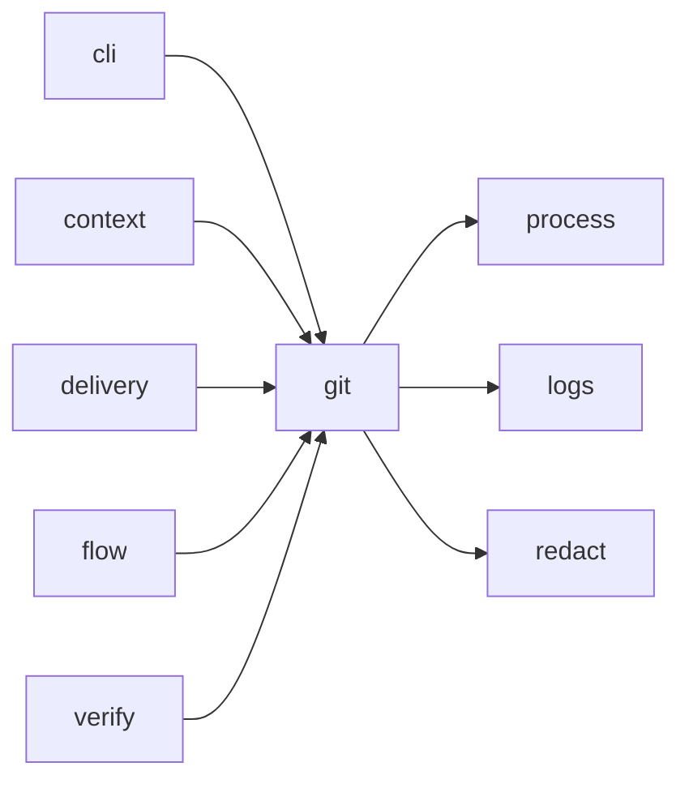

# Module `ariane.git`

The git operations Ariane performs itself: working trees, snapshots of the git configuration, guards against edits outside the tree, commits and the single authenticated push.

## Main types and functions

- `git`, `out`: run git and return output.
- `add_worktree`, `add_detached_worktree`, `remove_worktree`: ticket and replay trees.
- `worktree_of`, `merge_base`, `commit_messages`: where a branch is checked out, and what `ariane verify` reads of a branch (ADR 0028).
- `config_snapshot`, `snapshot_changes`: detect configuration tampering.
- `blocked_push_env`, `push_env`, `push`: push only from Ariane.
- `commit`: commits only the given paths; returns False when they hold no change, raises `GitError` when `git add` fails (for example an ignored `work/`), except with `tolerate_ignored=True` (used by `ariane verify`), which returns False so that it can say nothing was recorded.
- `head`, `changed_paths`, `committed_paths`, `is_ancestor`, `fast_forwarded`: history queries.
- `GitError`: raised on a failing git command.

## Collaborations

Arrows go from the caller to the callee.

## Serves

C8, C11, C21; ADR 0017, ADR 0018. See [the component view](../3-components.md).
