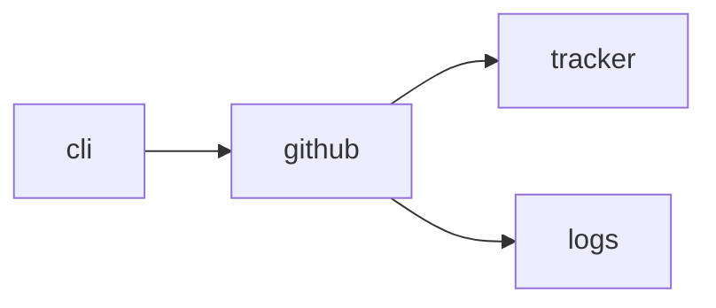

# Module `ariane.github`

The GitHub tracker over the REST API, with the standard library only.

## Main types and functions

- `GitHubTracker`: implements `Tracker` (read an issue, open a pull request, publish statuses).
- `web_url`: the web address matching an API address.

## Collaborations

Arrows go from the caller to the callee.

## Serves

C1; ADR 0007. See [the component view](../3-components.md).
