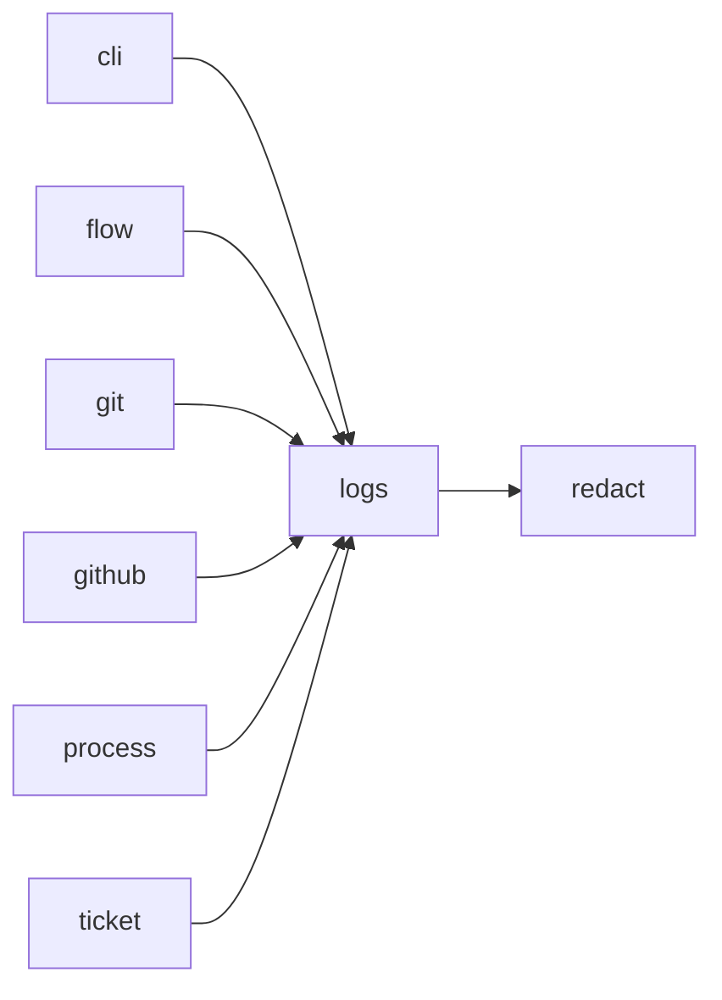

# Module `ariane.logs`

Declares every log type once (functional journal entries and technical records) with its identifier, level and meaning, and configures the technical logs: level, standard error, a log file outside the repository, and redaction.

## Main types and functions

- `LogType`, `FUNCTIONAL_TYPES`, `TECHNICAL_TYPES`: the declarations.
- `functional`: the declared journal entry type; an undeclared one is refused.
- `resolve_level`, `parse_level`: the level from `--log-level`, `ARIANE_LOG_LEVEL`, else warning.
- `configure`, `add_secrets`, `log_path`: handlers, known secrets and the log file `<repo>.ariane/logs/<n>.log`.
- `emit`: write one technical record naming its declared type.

## Collaborations

Arrows go from the caller to the callee.

## Reference

See the generated [log catalogue](../../logs.md), generated from the declarations (`scripts/generate_docs.py`).

## Serves

C21, C23; ADR 0022. See [the component view](../3-components.md).
