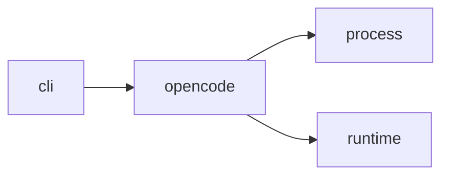

# Module `ariane.opencode`

opencode as an agent runtime, for the reviewer role: it starts `opencode run --pure --format json --model <provider/model> --agent ariane-<role>` with the prompt on standard input (no message argument, no length limit), in the session's working tree, and turns the event stream into a `SessionResult`. Its environment always sets `OPENCODE_DISABLE_PROJECT_CONFIG=1` (the replay tree's `opencode.json` is not read) next to `OPENCODE_DISABLE_CLAUDE_CODE=1`; Ariane's token cap is the only cap when the provider reports no cost.

- The environment adds `OPENCODE_CONFIG_CONTENT` (the agent `ariane-<role>` with `permission` `"*": "deny"` and `allow` for the role's tools only, `steps` as the turn cap, autoupdate off, sharing disabled), `OPENCODE_DISABLE_CLAUDE_CODE=1` and `OPENCODE_DISABLE_AUTOUPDATE=1`.
- opencode has no schema option: a session with a `json_schema` gets the schema in the message and must end with one fenced `json` block; the adapter parses the last block of the last text part into `structured_output` (Ariane validates it, ADR 0016).
- Events are read line by line: `step_finish` tokens (input, cache read, cache write, output) and cost are summed; the session stops (`budget`) when the token cap (`Session.max_tokens`) or the cost cap (`max_budget_usd`) is reached, killing the process tree. An `error` event or a non-zero exit is `error`; `finished` needs a `step_finish` with reason `stop`. A cost of 0 is "cost not reported".
- The title call has no `step_finish`: its usage is never reported, and `describe` says so with `opencode --version`, for the journal.

## Main types and functions

- `OpenCodeRuntime`: implements `AgentRuntime`; its login variables are the provider keys of its model (`login_variables`).
- `inline_config`: the `OPENCODE_CONFIG_CONTENT` text.
- `Events`: the running totals of a stream and the final answer.

## Collaborations

Arrows go from the caller to the callee.

## Serves

C5; ADR 0014, ADR 0015, ADR 0016, ADR 0029. See [the component view](../3-components.md).
