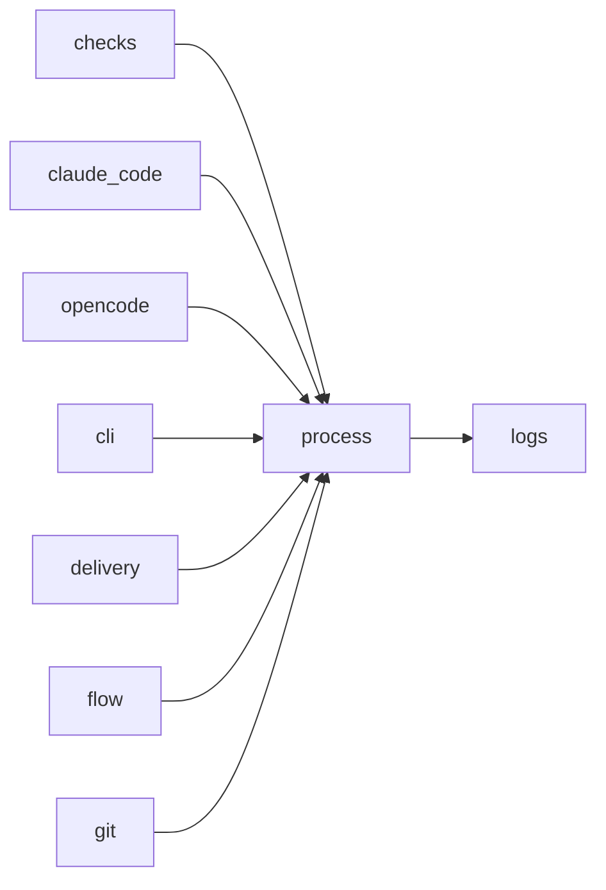

# Module `ariane.process`

Runs external commands from argument lists: PATH resolution, UTF-8 output, timeouts and cleanup of the whole process tree.

## Main types and functions

- `run`: run a command and return a `Completed`.
- `resolve`: find an executable.
- `stream`: like `run`, but passes each standard output line to a callback while the command runs; the callback returns True to stop the whole process tree (`Completed.stopped`).
- `_shown`: an argument as the `process.started` log line shows it, cut to 200 characters.
- `kill_tree`: stop a process and its children.
- `CommandNotFoundError`: raised for an unknown command.

## Collaborations

Arrows go from the caller to the callee.

## Serves

C9, C5; ADR 0001. See [the component view](../3-components.md).
