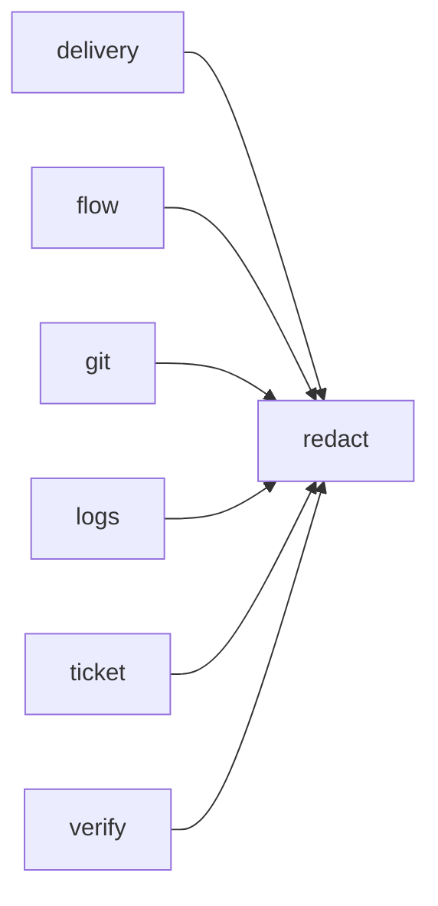

# Module `ariane.redact`

Masks known secrets and common token formats in any text that leaves Ariane.

## Main types and functions

- `redact`: return the text with secrets replaced.

## Collaborations

Arrows go from the caller to the callee.

## Serves

C21; ADR 0013. See [the component view](../3-components.md).
