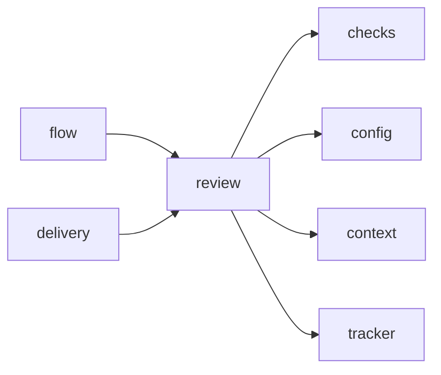

# Module `ariane.review`

The adversarial review (C10) and the definition-of-done answers (C26): the reviewer's prompt, the description and validator of its answer, and the rules Ariane applies to it.

## Main types and functions

- `SCHEMA`, `validate`, `parse`: the answer's description (also passed to the runtime as `--json-schema`; the Claude Code runtime drops its `$schema`), its validator and its typed form.
- `prompt`: the review instructions, the issue and the diff (untrusted data), the checks' summary and the sentence items.
- `settle`: `go` with a blocking finding is `no-go`; a sentence item missing or `met: false` is a blocking finding; check items come from the replay's results.
- `record`: the text of `work/<n>/review-0.md`. `pull_request_section`: the verdict, the item results and the findings table (3,000 characters at most, else a summary and a link).

## Collaborations

Arrows go from the caller to the callee.

## Reference

See the generated [JSON Schema of the answer](../../reference/review-answer.schema.json).

## Serves

C10, C26; ADR 0015, ADR 0016, ADR 0025. See [the component view](../3-components.md).
