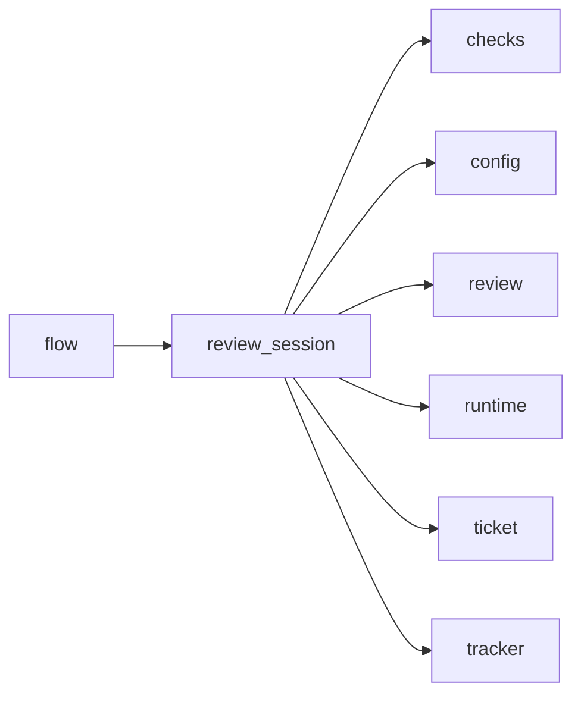

# Module `ariane.review_session`

The reviewer sessions of one review round (C10): a fresh read-only session in the clean replay tree, and one new session if its answer is invalid.

## Main types and functions

- `ReviewSession`: what the reviewer sessions of a ticket share; `run` returns the validated answer and calls back to verify that the session changed nothing.
- The journal line of a reviewer session starts with the reviewer's runtime as `runtime.describe` words it (for opencode: its version and that the title call's usage is not reported).
- `read_answer`: the validated answer of a session result, or the reason it is not one.
- `ReviewFailed`: no valid answer (the session did not finish, or two invalid answers); the flow turns it into a stop with status `needs a human`.

## Collaborations

Arrows go from the caller to the callee.

## Serves

C10; ADR 0016, ADR 0025, ADR 0027. See [the component view](../3-components.md).
