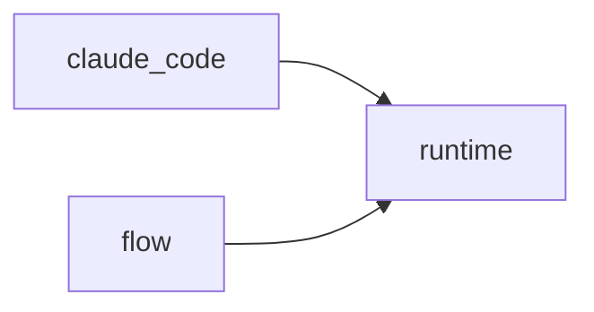

# Module `ariane.runtime`

The agent runtime interface: one fresh session per stage, whatever the agent CLI. Claude Code implements it, and opencode for the reviewer role.

## Main types and functions

- `AgentRuntime`: the protocol of a runtime; `login_variables` lists the exact names and prefixes (ending in `_`) of the variables it keeps in the agent's environment for its login (ADR 0024).
- `Session`: what to run, with the runtime's cost cap (`max_budget_usd`) and Ariane's optional token cap (`max_tokens`).
- `SessionResult`: what came back; `cap` names the cap that stopped a `budget` session. `usage()` words its cost and tokens for the journal (implementer and reviewer sessions).
- `RoutedRuntime`: one runtime per role (`[agents.<role>] runtime`); a session goes to the runtime of its role, it has no login variables of its own: each session's environment is built from `for_role(role).login_variables` (ADR 0029). `for_role` and `describe` are the helpers the journal uses: the runtime of a role, and its name with its version when it has one.
- `StopReason`: why a session ended.

## Collaborations

Arrows go from the caller to the callee.

## Serves

C5; ADR 0007, ADR 0014, ADR 0015. See [the component view](../3-components.md).
