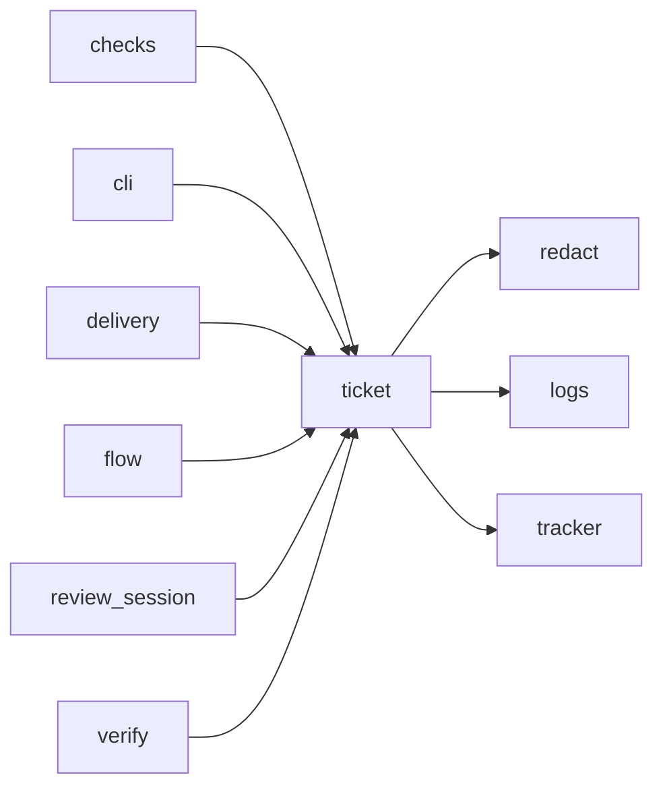

# Module `ariane.ticket`

The ticket folder `work/<n>/`: every document of a ticket, readable without Ariane, with its status file and brief.

## Main types and functions

- `TicketFolder`: write the documents of one ticket.
- `review_file`: the name of review round `n` (`review-0.md`, then `review-1.md` and `review-2.md` after fix rounds).
- `folder_path`, `relative_folder`: locations.
- `brief`: the issue as a document.
- `read_status`, `parse_status`: read the status file.
- `fence`, `fenced`: quote untrusted text safely.

## Collaborations

Arrows go from the caller to the callee.

## Serves

C1, C10, C23; ADR 0019. See [the component view](../3-components.md).
