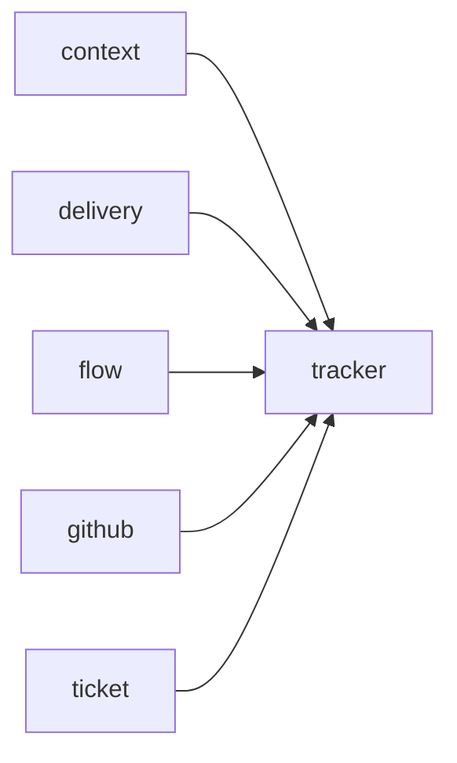

# Module `ariane.tracker`

The tracker interface: the only way Ariane talks to GitHub, another forge or a test double.

## Main types and functions

- `Tracker`: the protocol.
- `Issue`, `PullRequest`: the data exchanged.
- `InMemoryTracker`: the double used by tests.
- `TrackerError`: raised on a tracker failure.

## Collaborations

Arrows go from the caller to the callee.

## Serves

C1; ADR 0007. See [the component view](../3-components.md).
