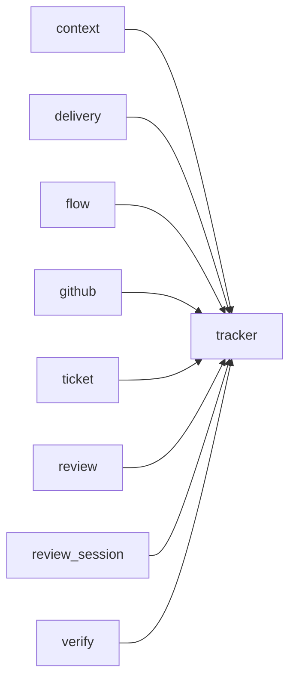

# Module `ariane.tracker`

The tracker interface: the only way Ariane talks to GitHub, another forge or a test double.

## Main types and functions

- `Tracker`: the protocol.
- `Issue`, `PullRequest`: the data exchanged.
- `InMemoryTracker`: the double used by tests; it records whether each pull request is a draft.
- `open_pull_request(..., draft=False)`: a draft pull request is not ready to merge (C10).
- `TrackerError`: raised on a tracker failure.

## Collaborations

Arrows go from the caller to the callee.

## Serves

C1, C10; ADR 0007, ADR 0027. See [the component view](../3-components.md).
