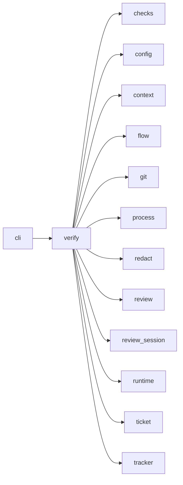

# Module `ariane.verify`

`ariane verify`: checks and reviews a local branch finished by hand (C10, C23). It replays the setup and the checks in a clean working tree at the branch's head, runs one read-only review, and commits `work/verify/<branch>/review.md` and `checks.md` (redacted) on top of the branch. It never pushes.

## Main types and functions

- `verify`: the entry point; returns an `Outcome` whose line gives the checks' summary, the verdict and the next action. Exit 0 only for a `go` with green blocking checks.
- `Refused`: the branch cannot be verified (unknown branch, uncommitted changes in the working tree that holds it, failed setup or reviewer).
- `replay_path`, `relative_folder`: where the replay tree and the records are.

## Collaborations

Arrows go from the caller to the callee.

## Serves

C10, C23; ADR 0016, ADR 0020, ADR 0028. See [the component view](../3-components.md).
