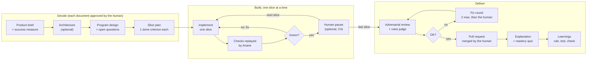
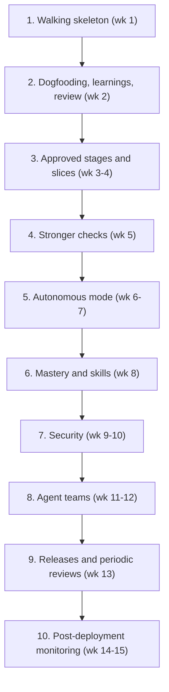

# Ariane — vision and specification

Version of 6 October 2026. This file is the reference specification; ADRs in `docs/adr/` record the decisions taken while implementing it.

Ariane turns tickets into reviewed pull requests with AI coding agents, while the human keeps deciding, understanding and approving. It spends the human's attention before the code and at a few checkpoints, instead of on a 2,000-line review at the end; the name comes from Ariadne's thread (*le fil d'Ariane*): you never lose the thread of your own code.

## How to use this document

This document is the only input of the sessions that implement Ariane. It says WHAT Ariane does and WHY; HOW (code structure, names, modules) is decided by those sessions.

1. **Written from scratch.** Ariane is a new code base. Do not consult, copy or adapt code from any other repository; build only from this document and the Ariane repository.
2. **Behaviour, not structure.** Every requirement is an observable behaviour with acceptance criteria. When the document is silent, choose the simplest design that meets it and record the choice as an ADR in `docs/adr/`.
3. **Follow the roadmap order.** Build slice 1 first, end to end, then each slice in order. Each slice ends with its gate checked.
4. **Ask, don't guess.** An ambiguity that changes behaviour goes to the human as a question, not into the code.
5. **Leave a trace.** Each session records what it was given and what it produced (commits, ADRs, the slice's gate result).

Capabilities are numbered C1 to C24 and referred to by number everywhere in this document.

## Vision

Agents write the code; the human keeps the decisions and the understanding. Ariane does not try to take the human out of the loop: it moves the human's effort to where it has the most leverage.

**The problem.** An agent solves an isolated problem very well, but nothing in its training penalises code that is hard to maintain: the cost of a bad design shows up in weeks, not seconds. Left alone, it produces code that passes the tests but drifts, and the human loses the thread of their own code. The day a bug resists every agent, finding one's way back takes days.

**The thesis.** The bottleneck is no longer writing code but trusting it. Trust comes from three sources, in this order of preference:

1. **Decide before coding**: the need, the measure of success, the architecture and the program design are approved by the human while changing course is still cheap.
2. **Deterministic evidence**: tests, linters, measurements, tests that fail without the change. A number beats an opinion.
3. **Framed opinions**: an adversarial review by a different model, and quality rules checked one by one as yes or no. An AI opinion never replaces evidence.

**Guiding principles**

- **The human stays in charge.** They approve every structuring decision, and Ariane checks that they still understand the code.
- **Small and verifiable first.** Work moves in vertical slices tested end to end, never in stacked invisible layers.
- **Nothing is taken on trust.** What an agent says it did is checked again by Ariane itself.
- **Short, targeted context.** Each agent gets the minimum it needs, as files in the repository, not a long conversation.
- **Learn from every failure.** Each failure becomes a rule, a test or a check so that it does not happen again.
- **Work on the real bottleneck.** Ariane exists to deliver value, not to optimise itself.

## Ideas taken from Dex Horthy's podcast

The podcast (David Andre with Dex Horthy of HumanLayer) gives the workflow its backbone: decide early, move in verifiable slices, turn "taste" into measurements, and keep the human in the code.

| Idea | What Ariane does with it |
| --- | --- |
| Models solve problems well, but nothing penalises them for hard-to-maintain code | Maintainability is defended by explicit checks (project rules, complexity, file size) and by the human, not by the agent (C9, C10) |
| A "light software factory" that stops reading the code ends with a bug nobody can fix | Ariane checks that the human still understands: an explanation and a short quiz after each delivery, and a deliberate slowdown when understanding drops (C17) |
| Product first: which user problem, how success is measured, write the announcement before the code | Every ticket starts with a product brief that has a measurable success indicator, approved by the human (C1, C2) |
| Architecture, then program design: types, signatures, call stack, test plan, without the bodies | A design step produces a short document (types, signatures, file locations, planned tests) that the human approves before any implementation (C2) |
| Ask the model which choices it is unsure of, before it codes | The design lists its uncertainties explicitly; the human settles each one (C2) |
| Vertical slices (tracer bullets): a minimal end-to-end path first, then the logic | The plan splits work into slices testable end to end; each slice is checked before the next (C4) |
| Back-pressure: a measurable outcome lets the agent "move mountains" | Each slice has an executable done criterion run by Ariane, not declared by the agent (C4, C9) |
| Tests that fail on the pre-patch code prove they test something | Ariane replays new tests on the code before the change; a test that already passed is flagged (C9) |
| An AI judge framed by rules, answering yes or no, is steadier than a free opinion | The project's quality rules are checked one by one, yes or no, with the line concerned (C10) |
| Put context in the repository (architecture decisions, external setup) | The repository holds the decisions (ADRs) and the external context; agents read them as files (C1, C22) |
| Keep the context window small; restart from a document rather than a long conversation | Each step starts a fresh session from the documents produced by the previous step (C5) |
| Load context deterministically instead of spending inference to look for it | Ariane assembles a step's context itself (files, decisions, rules) before calling the agent (C5) |
| Some inefficiencies are not the bottleneck | Ariane measures where human and machine time goes, to show the real bottleneck (C19) |
| Route incidents into the factory: wake up to a pull request, not an alert | After a deployment, Ariane watches production and turns a problem into a documented incident ticket (C15) |

Not taken: running the factory without a human, and optimising the tool for its own sake ("stop playing with your coding agents and get back to work").

## Workflow

A ticket goes through three phases: decide (the human approves each document), build slice by slice (Ariane replays the checks after each one), then deliver while checking that the human still masters the code.

1. **Product brief**: the user problem, the success indicator, the announcement written before the code (C1, C2).
2. **Architecture** (optional for a small ticket, C3): components, flows, data, decisions recorded as ADRs.
3. **Program design**: types, signatures, file locations, planned tests, and the list of points the agent is unsure of, which the human settles (C2).
4. **Slice plan**: the first slice is a minimal end-to-end path; each slice has an executable done criterion (C4).
5. **Construction**: one slice at a time, checks replayed by Ariane (C9), human pause when the mode is on.
6. **Review**: adversarial review by another model and the rules judge; at most two fix rounds, then the human takes over (C10).
7. **Delivery**: pull request, merged by the human (C11).
8. **Mastery and learning**: explanation and quiz (C17); every failure becomes a rule, a test or a check for the next tickets (C18). After deployment, Ariane watches production and turns a problem into an incident ticket (C15).

## Functional specification

Twenty-four capabilities in six groups, each with acceptance criteria. A criterion that no command or observation can check is not a criterion.

### A. Tickets and workflow

#### C1. The ticket folder and format

Each ticket has a folder in the repository (for example `work/<id>/`) holding all its documents: product brief, architecture, design, plan, journal, review findings. The tracker is the entry point and the notification channel; the truth is in the files. Ariane talks to the tracker only through one interface (read a ticket, comment, set labels, claim, open a pull request): GitHub first, GitLab later, and an in-memory tracker for tests.

- Creating a ticket from an issue creates its folder, with the product brief prefilled from the issue.
- The issue body follows a format (a project can declare its own required sections, C22), by default: Context, Current state (verified, with `file:line` references), Decided spec, Release note, Acceptance criteria, Acceptance checklist, Out of scope, Related, and an optional Budget. Agents read the title and the body, never the comments: anything decided in a comment must be moved into the body.
- Each document has a readable status (`draft`, `to approve`, `approved`) and its approval date.
- An agent reads only the folder's files and the repository, never a conversation history.

#### C2. Stages and human approvals

A ticket goes through ordered stages: product brief, architecture (optional for a small ticket), program design (with its list of uncertainties), slice plan, construction, review, delivery. A stage starts only once the previous one is approved by the human, with an explicit command.

- Running a stage whose predecessor is not approved is refused, with a message naming the missing approval.
- The human can ask for a revision with a comment; the agent writes a new version, and git keeps the previous one.
- A ticket whose description is not a settled spec (missing Decided spec or a parseable acceptance checklist) is refused before any agent runs, with a comment that lists what is missing. Before the human approves a product brief or a design, a reviewer model attacks it (missing cases, contradictions, untestable criteria) and its findings are shown with the document.
- A human takeover (the human finishes a ticket by hand) is recorded in the journal.

#### C3. Risk-based depth

Not every ticket needs the full flow. Ariane proposes a depth, light or full, from measurable signals: diff size, number of modules touched, sensitive paths, labels.

- At light depth, architecture and per-slice pauses are skipped; deterministic checks (C9) and review (C10) stay mandatory.
- A risk signal that appears mid-way switches to full depth, with a message saying why.
- The human can always force full depth.

#### C4. Vertical slices

The plan splits the work into slices. Each slice has a goal, an executable done criterion and the list of files it expects to touch. The first slice is a minimal end-to-end path.

- Slices are implemented one at a time; the next starts only when the previous one is green.
- A slice that touches unplanned files, or exceeds a set size in changed lines, is flagged to the human.
- In "pause per slice" mode, the human sees a summary and the slice's diff before Ariane continues.

### B. Agents

#### C5. Agent sessions

Each stage runs a fresh agent session with a role (writer, implementer, reviewer, rules judge, analyst), a model, a tool allowlist, a budget and a time limit. Sessions run through one agent runtime interface: Claude Code first, opencode second, and each role can use a different runtime and model provider. A runtime that cannot honour a role's needs (tool allowlist, structured output with stop reason and cost, declared skills) is refused for that role at start-up, with the missing feature named.

- Ariane assembles the session's context itself (approved documents, rules, relevant learnings, files named in the plan) and records it in the journal. Ticket text, diffs, test output and tracker comments enter the context as clearly delimited untrusted data.
- Only the allowlisted tools are available; no extra tool server is reachable unless the project declares it.
- Ariane classifies why a session stopped (finished, budget, turn limit, timeout, error) from the agent's structured output, and records cost and tokens as the agent reports them, never as estimates.
- A session stopped by budget, turns or timeout leaves its work saved on the ticket branch and a clear status; the next run resumes it, with a larger budget after a budget stop, capped by the configuration.
- A ticket can declare its own budget (cost and duration per role); the configuration caps it, and the applied cap is written in the journal.

#### C6. Skills per role

The project declares, role by role, which agent skills a session may use (for example from gstack or unlazy). An undeclared skill is unavailable.

- Each skill is installed at a pinned version (a commit or exact version), never a moving branch.
- A skill that pushes, merges, publishes or deploys (for example gstack's `ship` or `land-and-deploy`) is refused for every role: delivery stays as defined in C11.
- Reviewers and judges get read-only skills only; Ariane checks afterwards that the working tree did not change.
- The skills actually loaded by a session are recorded in the ticket's journal.

#### C7. Agent teams

A stage can hand its work to a team of specialised agents, coordinated by Ariane, instead of one generalist.

- **Team review**: several reviewers in parallel (maintainability, security, tests), each with its own rules; a negative verdict from any of them blocks delivery.
- **Team construction**: slices the plan declares independent, touching disjoint files, run in parallel in separate working trees; an integration step merges them and replays every check.
- Two agents never edit the same file at the same time; an integration conflict hands control to the human.
- A team's budget is the capped sum of its members'; the journal shows each member's cost and duration.

### C. Verification

#### C8. Environment setup

The project declares a setup command (for example `uv sync`, `npm ci`, `cargo fetch`) that runs once in each fresh working tree, before the first agent.

- A failure stops the ticket in error with the command's output (redacted, C21), and no agent runs.
- If setup leaves files that git does not ignore, the ticket stops with a message asking to ignore them.
- A resumed working tree (C5) is not set up again.

#### C9. Deterministic checks

The project declares named checks (lint, types, tests, complexity, file size, coverage), each blocking or advisory. Ariane runs them itself; it never believes an agent that says they pass.

- Checks run after each slice and before delivery, all of them even when one fails, and the report has one section per check plus a final summary line. Each check declares when it runs (after each slice, before delivery, or both), so a slow full suite can run only before delivery. Before a ticket starts, the checks run once on the base branch: a check already failing there is recorded and not blamed on the ticket. A project can declare a guard command that postpones work while the machine is busy (for example a long GPU job).
- Tests added by a slice are replayed on the code before the slice: a test that already passes there is flagged as "tests nothing".
- A ticket can carry a mechanical acceptance checklist (a file exists, a line matches a pattern, a section is unchanged), checked by Ariane without a model.
- The project can set a total coverage threshold and a threshold on the lines the ticket changed, read from a standard report (Cobertura or LCOV); a command also measures the main branch's coverage on demand, in a throwaway working tree.
- A failing blocking check prevents delivery.
- Ariane publishes each check's result as a status on the pull request's head commit (a GitHub commit status; the equivalent on other trackers), so the results show next to the pull request and branch protection can require them.

#### C10. Review

Before delivery, two independent reviews: an adversarial review by a different model from the implementer's, and a rules judge that checks the project's quality rules one by one.

- The reviewer gives a verdict and findings marked blocking or minor; a positive verdict that lists a blocking finding counts as negative.
- The judge answers yes or no for each rule, with the line concerned.
- At most two automatic fix rounds; after that the ticket goes to the human.
- Findings are posted to the tracker (inline when short, as an attachment otherwise, never at a URL readable by anyone who has it), redacted (C21), and kept in the ticket folder with the commit they reviewed.

### D. Delivery and operations

#### C11. Isolation and delivery

Each ticket works in its own git working tree and branch. Ariane never touches the main checkout and never pushes to the main branch.

- Delivery is the pushed branch plus an open pull request (or merge request); the human merges. If the base branch moved, Ariane rebases the ticket branch, runs the project's regeneration command if one is declared, and replays every check; a conflict goes to the human.
- Two tickets never share a working tree. A project can declare environment variables that redirect the application's data into the working tree, so no agent writes to real data.
- An agent cannot push, switch branches or rewrite history. Changes left by the project's formatter or commit hooks are committed by Ariane, not treated as an unexplained dirty tree.

#### C12. Autonomous mode and notifications

Ariane can watch the tracker and process tickets marked for it, started by the system scheduler (Task Scheduler on Windows, launchd on macOS, systemd or cron on Linux).

- It processes only a marked ticket whose previous stage is approved; it stops at every human checkpoint and notifies.
- Notifications (stage done, approval awaited, error, incident) go through a configurable channel (for example ntfy, e-mail, Slack).
- Repeated failures to read the tracker raise one alert, not one per attempt.

#### C13. Several machines

Several machines can watch the same tracker without processing the same ticket twice.

- A machine claims a ticket on the tracker before working on it and releases it at the end. An abandoned claim expires after a delay longer than the longest silent step: the maximum session time is therefore capped below that delay.
- A responsible human can be assigned to the ticket; approval requests go to them.
- On one machine, only one Ariane instance runs at a time.

#### C14. Control by labels

The human steers a ticket from the tracker, without opening Ariane.

- Control labels: hold, do not deliver, force full review, force security review.
- Status labels kept by Ariane (in progress, approval awaited, needs a human, delivered), always consistent with the ticket folder.

#### C15. Post-deployment monitoring

Ariane does not deploy: deployment stays the project's (CI or human). After each deployment of a pull request Ariane delivered, it checks that production is healthy and turns a problem into a documented ticket.

- Probes are declared per project: a health URL with the expected status and response time, a check command, or a metric query (error rate, latency) with a threshold. Each probe is named and marked blocking or advisory.
- Ariane detects that a delivered pull request is in production (a tracker deployment event, a tag, or a manual command) and watches it for a configured window (30 minutes by default), against a baseline taken just before.
- On failure: an immediate alert, and an incident ticket with the measurements, the window, and the ticket and pull request involved. A read-only analyst agent writes a first analysis (likely cause, possible fix, external dependency down or not). It may propose a revert pull request, never merge or deploy it.
- Probes run inside Ariane, not in an agent; their credentials are read-only and never in an agent's context.
- An existing monitoring skill (for example gstack's `canary`) can serve as a probe if declared read-only (C6).
- Acceptance: a failing blocking probe creates an incident ticket naming the probe, the measurement, the threshold, the pull request and the original ticket; a failing advisory probe is reported without an incident; nothing Ariane does can change production.

#### C16. Release notes

Each ticket carries a one-sentence release note (Added, Changed, Fixed, Removed, Security, or none). A command assembles a changelog and release draft from the tickets delivered since the last version.

- A ticket without a release note is flagged when its product brief is approved.
- The draft is never published without the human.

### E. Learning and control

#### C17. Human mastery

After each delivery, Ariane writes a short explanation (what changed, why, a diagram) and a 3 to 5 question quiz on the actual code. It tracks the scores over time.

- Questions are about the ticket's diff and the state of the code, with each answer justified by an excerpt.
- A falling score, or quizzes skipped several times in a row, raises a warning and turns on "pause per slice" mode (C4).
- The quiz can be skipped for one ticket, never silently disabled for all.

#### C18. Learnings

Each failure (negative verdict, human correction, bug found later, incident) leads to a proposal: a rule, a test, a check or a probe so that it does not happen again.

- Reviewers propose learnings in a fixed format; Ariane validates them and the human accepts or rejects each one.
- An accepted rule joins the project's rules file and is checked by the judge (C10).
- Learnings relevant to a ticket are selected and injected into the agents' context, within a size limit.
- The store is pluggable: a file in the repository by default, or an external tool (gstack, gbrain, or any command that reads and writes records).

#### C19. Measurement

Ariane measures, per ticket and per step: agent duration, human waiting time, cost, tokens, number of rounds, first-pass verdict, failure causes (spec, implementation, security), mastery score, and incidents per delivered ticket.

- A command produces a report over a period that shows where time goes (the bottleneck).
- Costs shown are those the agent reported, never estimates.

#### C20. Periodic reviews

Every N delivered tickets, Ariane runs a read-only review in depth and proposes tickets, without creating them.

- Refactoring review: files that are too long, duplication, coupling, against the project's thresholds.
- Documentation audit: statements that are wrong, missing or out of date compared with the code.

### F. Platform

#### C21. Security

Agents never see a secret, and nothing they produce is published without redaction.

- Tokens and keys Ariane knows are never in an agent's context; every published output (comments, attachments, incident tickets, logs) is filtered for known secrets and common token formats before posting.
- A ticket that touches declared sensitive paths gets a dedicated, read-only security review.
- A project can declare forbidden terms (stored hashed) that must never appear in tracked files or in anything Ariane posts; a check enforces it.
- Agents run with the least privilege their role needs; reviewers cannot write, and Ariane verifies afterwards that the tree did not change. The guard that enforces this comes from Ariane, never from the working tree: a ticket that edits agent configuration or hooks is judged by the unedited guard, and those paths are sensitive by default.

#### C22. Project configuration

One configuration file in the repository describes the tracker, the ticket format, the checks and when each runs, the setup, regeneration and busy-machine guard commands, the data-redirection variables, the quality rules, the models per role, the budgets and their caps, the document language, the sensitive paths and the forbidden terms.

- An invalid configuration is refused at start-up with a message naming the faulty key.
- Ariane works for any language: it only knows commands to run.
- The project can add its own instructions per role (conventions, prohibitions, style) as files appended to Ariane's prompts. Ariane tells each session its role (for example in an environment variable), so the project's own agent instructions and hooks can adapt instead of sending the agent into a workflow it cannot run. Commit message and pull request title conventions (language, prefix) are declared per project.

#### C23. Command line

One command-line tool, usable on Windows (PowerShell), macOS and Linux: create a ticket, show its status, approve or revise a stage, run the next stage, list tickets, verify a checklist, produce reports.

- Each command says in one line what it did and what the next possible action is.
- A ticket's state is readable without Ariane, by opening its folder.

#### C24. Setup assistant

A command guides the installation on a new project: it asks what it needs (tracker, checks, setup command, models, budgets), proposes defaults suited to the detected language, then writes and validates the configuration.

- At the end, a diagnostic command checks tracker access, the tools on the path, and a first run of the checks.

## Non-functional requirements

| Area | Requirement |
| --- | --- |
| Platforms | Windows (PowerShell 5.1 and 7), macOS and Linux, each tested in CI from slice 1; also runs in cloud sandboxes (as root, behind an HTTPS proxy) |
| Encodings | Every subprocess output and every file is read and written as UTF-8 explicitly, never with the system locale (cp1252 on Windows corrupts or crashes on non-ASCII); invalid bytes are replaced, never fatal |
| Processes | Commands run as argument lists, never through a shell; executables are resolved through the PATH lookup so that Windows `.cmd` shims (`npm`, `npx`) work; a timeout kills the whole process tree, not only the direct child |
| Shell-facing text | Any script Ariane ships runs on PowerShell 5.1 (no `&&`); any command shown to an agent is quoted for the agent's shell (Git Bash on Windows) |
| Robustness | An interruption (crash, budget, timeout, reboot) never loses work; all state can be rebuilt from the ticket folder, git and the tracker; several projects on one machine never share state (lock, working trees, journal) |
| Security | Least privilege per role; no secret in an agent's context; every published output redacted; agents never push |
| Cost | A budget per session and per ticket, capped by the configuration; Ariane stops cleanly at the cap |
| Observability | One human-readable journal per ticket: which step ran, with which context, for which result and cost |
| Maintainability of Ariane | Short single-purpose modules; a file-length limit checked from slice 1 (no file over 600 lines); every capability tested; refactors done as pure moves first, behaviour changes after |
| Dependencies | As few as possible; each added dependency is justified in an ADR |

## Roadmap

The order follows two rules: use Ariane on itself as early as possible, and learn from its mistakes from the start. From slice 2 on, every new Ariane ticket goes through Ariane and every failure becomes a learning, so later slices already benefit from what was learned.

Weeks are estimates from 5 October 2026, revised at every gate.

| Slice | Capabilities | Gate (checked before the next slice starts) |
| --- | --- | --- |
| 1. Walking skeleton | C1, C5, C8, C9, C11 and C22 in minimal form; C23 to start a ticket; CI on Windows, macOS and Linux | A real issue becomes a pull request whose checks Ariane replayed green |
| 2. Dogfooding, learnings, review | C18 (file store), C10 (one reviewer), C19 (cost, rounds, first-pass verdict), redaction of everything posted (C21, basic), check results as commit statuses (C9) | Ariane's own tickets go through Ariane |
| 3. Approved stages and slices | C2, C4, per-ticket budget (C5), approve and revise commands (C23) | No stage starts without human approval |
| 4. Stronger checks | C9 complete (pre-change replay, checklist, coverage), rules judge (C10), C3 | A test that tests nothing is flagged; the rules judge runs |
| 5. Autonomous mode | C12, C13, C14, resume after interruption (C5) | A killed session resumes; two machines never work on the same ticket |
| 6. Mastery and skills | C17, C6, project instructions (C22), pluggable learning stores (C18), opencode as a second agent runtime (C5) | A quiz follows every delivery; only pinned, declared skills load |
| 7. Security | C21 complete (security review, forbidden terms), C24 | No secret reaches an agent's context or anything Ariane posts |
| 8. Agent teams | C7 | Two parallel slices are integrated with every check green |
| 9. Releases and periodic reviews | C16, C20 | A release draft is produced, and a review runs every N tickets |
| 10. Post-deployment monitoring | C15 | A simulated outage creates a documented incident ticket and an alert |

A missed gate is fixed before the next slice starts.

## Adopting Ariane on an existing project

A project that already has a working agent process switches to Ariane only after Ariane has proved, on that project, that it does at least as well; the existing process stays the reference until then.

1. **Inventory.** List every step and guarantee of the existing process; each one must be carried by Ariane or by the project's configuration and hooks. A step neither covers blocks the switch.
2. **Shadow.** Ariane processes real tickets without pushing, with its own state, while the existing process does the real work. Pass over 10 tickets: no agent push or pull-request attempt, no write to real data, no guard violation, Ariane's diff judged acceptable by the human in at least 8, cost and duration recorded.
3. **Cohabitation.** Tickets marked for Ariane go through it as pull requests; the human still merges each one. Pass when 10 of them are merged with no revert and CI green before merge.
4. **Switch.** Ariane becomes the default; the old process remains for the tickets Ariane refuses, until it is no longer used.

## Decisions

All nine founding choices were made on 5 October 2026.

| Decision | Choice |
| --- | --- |
| Name | Ariane; command `ariane`; the PyPI name `ariane` was free on 5 October 2026; the GitHub account name ariane is taken, so the repository lives under the owner's personal account |
| Language | Python |
| Language of the repository, documents and prompts | English |
| Platforms | Windows, macOS, Linux |
| Tracker | An abstraction from day one; GitHub by default, GitLab later |
| Models | One model per role; implementer and reviewer always different |
| Agent runtime | An abstraction from day one (C5); Claude Code by default, opencode second (slice 6) |
| Agent teams | Yes (C7): team review first, then parallel construction |
| Delivery | Pull request, merged by the human |
